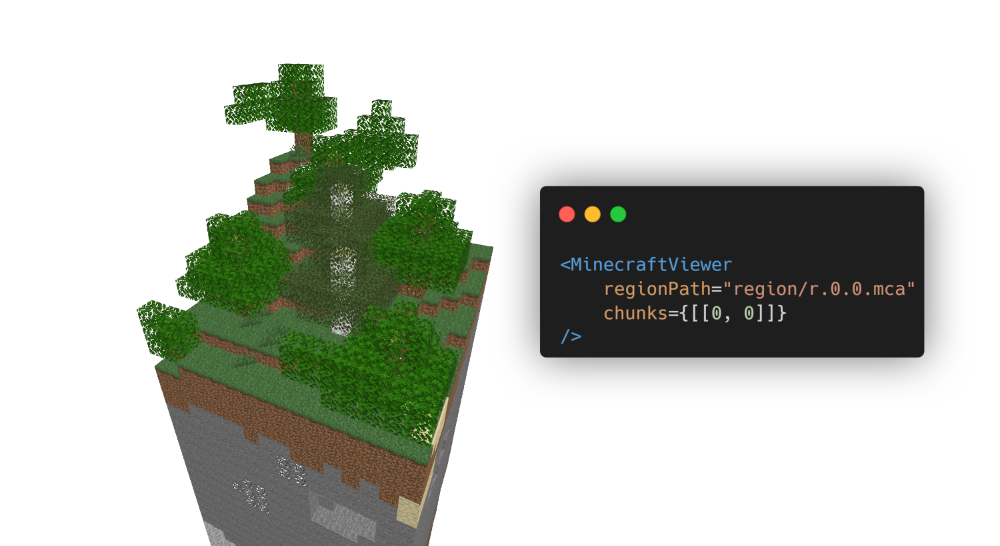

# React Minecraft Region Viewer

A simple component for displaying a part of Minecraft region file with React.js.

This project is based on [Deepslate](https://github.com/misode/deepslate) library and a majority of the code is extracted from the [NBT viewer for VS Code extension](https://github.com/misode/vscode-nbt/tree/master).

## Setup

You can install the package using `npm install react-minecraft-viewer` command.

React Minecraft Region Viewer does not ship with the minecraft resources included. You need to export your own ResourcePack for this component to work. You can do that by opening your Minecraft JAR file, extracting the `assets` folder and packing it as a `.zip` file.

## Disclaimer

This project is under development. Feel free to contribute.
